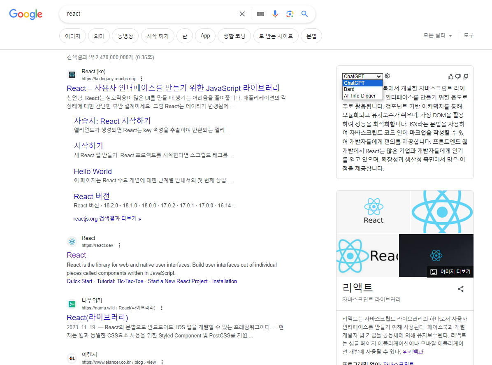

# All-Information-Digger

LLM and Google Integration.

**All-info-digger** reduces hallucinations.

# Usage

1. ```npm install```
2. ```npm run build```
3. Add **build/chronium** directory to chrome extension.

# Example

## UI 
## A-I-D gif 

# Notice

1. [npm reference](https://www.npmjs.com/package/npm)
2. To use Bard, Google login is essential first.
3. So far, only Korean answers are supported.